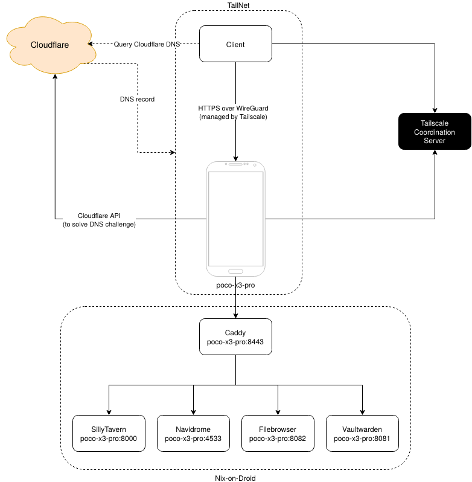

# nix-on-droid-config
This repository contains my [nix-on-droid](https://github.com/nix-community/nix-on-droid) server configuration. It hosts web apps and exposes them on a custom domain with [Caddy](https://caddyserver.com), [Cloudflare DNS](https://github.com/caddy-dns/cloudflare) and [Tailscale](https://tailscale.com/).

## Private Services
> These subdomains point to a Tailscale IP, so you won't be able to access them on the public internet.
- [VaultWarden](https://github.com/dani-garcia/vaultwarden) (password manager): https://vaultwarden.osipol.uk:8443
- [NaviDrome](https://www.navidrome.org/) (music server): https://navidrome.osipol.uk:8443
- [SillyTavern](https://docs.sillytavern.app/) (LLM frontend): https://sillytavern.osipol.uk:8443/
- [File Browser](https://filebrowser.org/) (web file manager): https://filebrowser.osipol.uk:8443

## Highlights
- Zero Trust networking with [Tailscale](https://tailscale.com/) (via the [Android app](https://play.google.com/store/apps/details?id=com.tailscale.ipn&hl=en_AU&pli=1)).
- Service management with [runit](https://smarden.org/runit/).
- Declarative server configuration using [flakes](https://wiki.nixos.org/wiki/Flakes) and [Home Manager](https://github.com/nix-community/home-manager).
- File synchronisation with [Syncthing](https://syncthing.net/).
- Secret management with [agenix](https://github.com/ryantm/agenix).

## Hosts

| Hostname | Model | Android Version | CPU | RAM | Storage |
| :--- | :--- | :--- | :--- | :--- | :--- |
| poco-x3-pro | Xiaomi Poco X3 Pro | 12 | Octa-core Max 2.96GHz | 8 GB | 256 GB |


## Network Diagram


## Installation


1. Install [Nix-on-Droid](https://github.com/nix-community/nix-on-droid) on an Android device. Set up with flakes (may take 20-30 minutes).
Optional but highly recommended:
2. Install [Tailscale](https://tailscale.com/) on your device and where you will be SSHing into the device. (optional but highly recommended)
3. On the device:
```bash
cd ~/.config/nix-on-droid

vi nix-on-droid.nix
# Use vi to add git-minimal to environment.packages
# Optional: Add iproute2 (to get IP address), nano (alternative text editor)
nix-on-droid switch

# If you are forking, don't forget to update these files
# system/sshd.nix: Add your SSH public key
# secrets/*: Configure your agenix secrets
# nix-on-droid.nix: Update user.gid and user.uid with the results of `id nix-on-droid` on your device
# config/Caddyfile: Update domain

cd ..
git clone https://github.com/queze1/nix-on-droid-config.git  # or your fork
cd nix-on-droid-config
nix-on-droid switch  # may take an hour or more for the first time
```
4. Test if SSH has been configured correctly:
```bash
# Use Tailscale DNS or get your device's IP address with `ip addr`
ssh -p 8022 nix-on-droid@YOUR_PHONE
```
5. Optional: Set up remote deployment with [deploy-rs](https://github.com/serokell/deploy-rs). ([guide](https://github.com/nix-community/nix-on-droid/wiki/Remote-deploy-with-deploy%E2%80%90rs))
  - Without remote deployment, updating `nixpkgs` can take around 30 minutes in evaluation time (depending on phone specs).

## Useful Commands
```bash
# Start SSH daemon manually
# Run if SSH stopped working after a restart or crash
sshd-start

# Alias to pull changes and rebuild
# Equivalent to `cd ~/.config/nix-on-droid-config/ && git pull && nix-on-droid switch --flake .`
rebuild

# By default aliases to `cd ~/.local/state/runit/services`
cd-service-dir

# By default aliases to `cd ~/.local/var/log/services`
cd-log-dir

# Shell script to manage runsvdir
runit-manager start|stop|status
```

